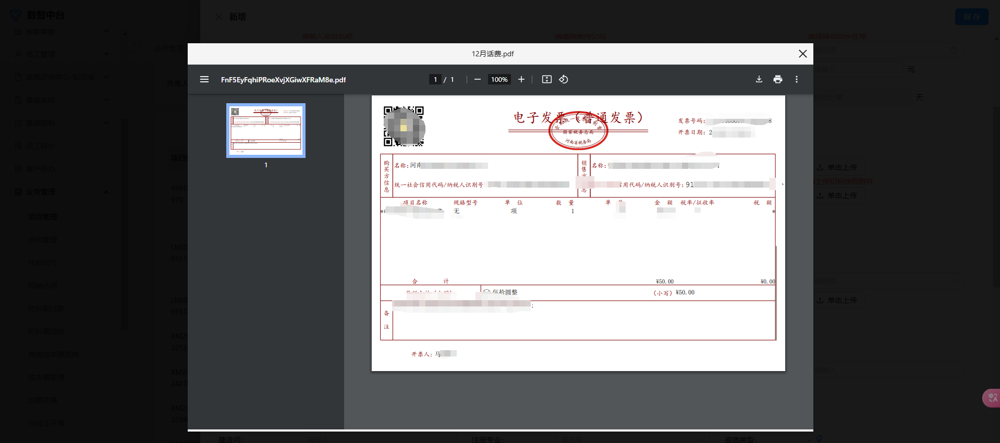
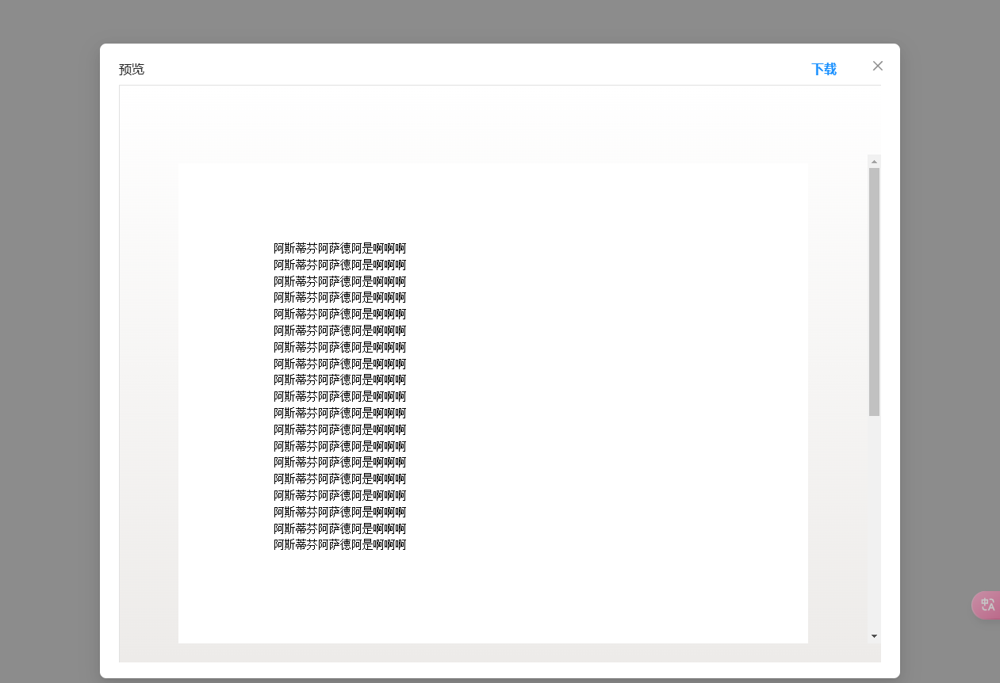

# Vue Doc Viewers Plus

一个基于 Vue 3 的文档预览组件，支持 PDF、Office 文档和图片预览。

## 安装

```bash
npm install vue-doc-viewers-plus
```

## 使用方法

### 1. 引入组件和样式

```js
import { DocViewerPlus } from 'vue-doc-viewers-plus'
import 'vue-doc-viewers-plus/dist/style.css'
```

### 2. 在模板中使用

```vue
<template>
  <doc-viewer-plus
    :file-url="fileUrl"
    :file-name="fileName"
    v-model:visible="visible"
  />
</template>

<script setup>
import { ref } from 'vue'
import { DocViewerPlus } from 'vue-doc-viewers-plus'
import 'vue-doc-viewers-plus/dist/style.css'

const fileUrl = ref('')
const fileName = ref('')
const visible = ref(false)

// 打开预览
const preview = () => {
  fileUrl.value = 'https://example.com/sample.pdf'
  fileName.value = 'sample.pdf'
  visible.value = true
}
</script>
```

## 预览效果

### PDF 预览


### Office 文档预览


### 图片预览


## Props

| 属性名 | 类型 | 必填 | 默认值 | 说明 |
|--------|------|------|--------|------|
| fileUrl | string | 是 | - | 文件的 URL 地址 |
| fileName | string | 否 | - | 文件名（用于下载时的文件名） |
| visible | boolean | 否 | false | 控制预览窗口的显示/隐藏 |

## 支持的文件类型

### 图片
- jpg/jpeg
- png
- gif
- bmp
- webp

### PDF
- pdf

### Office 文档
- doc/docx（Word）
- xls/xlsx（Excel）
- ppt/pptx（PowerPoint）

## 特性
- 支持图片预览和缩放
- 支持 PDF 在线预览
- 支持 Office 文档在线预览（使用微软 Office Online 服务）
- 支持文件下载
- 响应式设计
- 支持 Vue 3 和 TypeScript

## 注意事项
1. Office 文档预览需要文件可以通过公网访问
2. 确保引入了组件样式文件 `vue-doc-viewers-plus/dist/style.css`

## License

MIT
